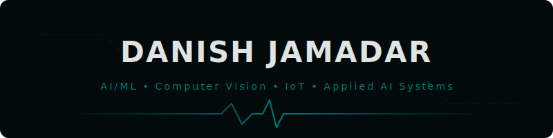

  

  

## About Me

- 🔭 I’m currently working on AI, Computer Vision & IoT-based projects
- 👯 I’m looking to collaborate on Open Source, AI/ML & impactful software projects
- 🤝 I’m looking for help with System Design, DevOps & building production-ready applications
- 🌱 I’m currently learning Deep Learning, scalable software design & advanced ML workflows
- 💬 Ask me about Python, Machine Learning, OpenCV, APIs, YOLOv8, IoT & GitHub
- ⚡ Fun fact: I like building practical AI prototypes that solve real-world problems

  

## Socials

  
  &nbsp;
  
  &nbsp;
  

  

## Tech Stack

 &nbsp;  &nbsp;  &nbsp;  &nbsp;  &nbsp;  &nbsp;  &nbsp;  &nbsp;  &nbsp;  &nbsp;  &nbsp;  &nbsp;  &nbsp;  &nbsp;  &nbsp;  &nbsp;  &nbsp;  &nbsp;  &nbsp;  &nbsp; 

  

## GitHub Stats

  
  &nbsp;&nbsp;
  

  

  

## Random Dev Quote

  

  

 

  

